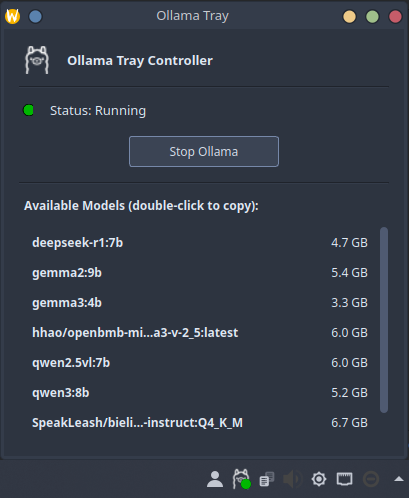

# Ollama Tray Controller

Ollama Tray Controller is a lightweight application written in Python with PyQt5 that allows convenient management of the Ollama service from the system tray.



## Features

- Convenient system tray icon with status indicator (green for running, gray for stopped)
- One-click access to start and stop the Ollama service
- Shows list of installed Ollama models with easy copy functionality
- Complete integration with KDE's native look and feel
- Uses system authentication dialogs (via polkit)

## Requirements

- KDE Plasma desktop environment
- Python 3.x
- PyQt5
- Ollama installed and configured as a systemd service
- The Ollama SVG icon (place in `src/`) in diferent color variants

## Installation

1. Clone this repository:

```bash
git clone https://github.com/zdziejowski/ollama-tray-controller.git
cd ollama-tray-controller
```

2Set execution permissions:

```bash
chmod +x ollama_tray_kde.py
```

## Usage

Launch the application from the terminal:

```bash
./ollama_tray_kde.py
```

Or add it to autostart to launch automatically after login.

## Adding to Autostart

1. Create a .desktop file in the autostart directory:

```bash
mkdir -p ~/.config/autostart
```

2. Create the file `~/.config/autostart/ollama-tray-kde.desktop` with the following content:

```
[Desktop Entry]
Type=Application
Name=Ollama Tray
Comment=System tray app for Ollama control
Exec=/full/path/to/ollama_tray_kde.py
Icon=computer
Terminal=false
Categories=Utility;
StartupNotify=false
```

3. Replace `/full/path/to/` with the actual path to the script.

## How It Works

The application regularly checks the status of the Ollama service using `systemctl` and updates the icon:
- Green ✓ icon: service is running
- Red ✗ icon: service is stopped

Right-clicking on the icon shows a menu with options:
- Status: information about the current state
- Toggle Ollama: changes the service state (requires sudo password)
- Quit: closes the tray application

## Customization

You can customize the script by modifying:

- The status refresh interval (default 5000ms):
  ```python
  self.timer.start(5000)  # Change to a different value in milliseconds
  ```

- Status icons by changing the `QIcon.fromTheme()` parameters:
  ```python
  self.setIcon(QIcon.fromTheme("different-system-icon"))
  ```

- Interface texts by changing the corresponding strings.

## License

This project is distributed under the MIT License. See the [LICENSE](LICENSE) file for details.

## Author

Created by Wojciech Zdziejowski - [GitHub](https://github.com/zdziejowski/)

---

## Troubleshooting

### The application doesn't show an icon in the system tray

Make sure your KDE environment has system tray support enabled.

### Sudo permission errors

Make sure your user has sudo permissions for systemctl commands.

### Custom icons

If you want to use custom icons instead of system ones, change the code:

```python
# From:
self.setIcon(QIcon.fromTheme("dialog-ok"))

# To:
self.setIcon(QIcon("/path/to/icon.png"))
```
